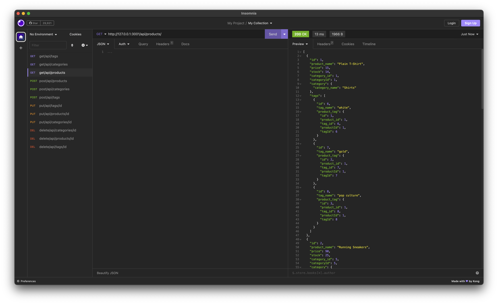
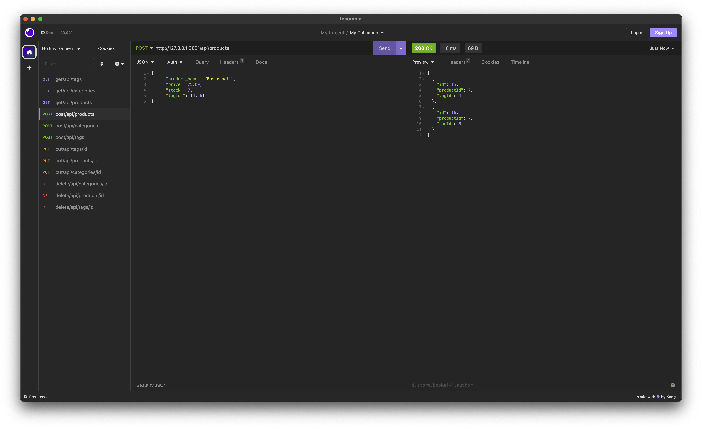
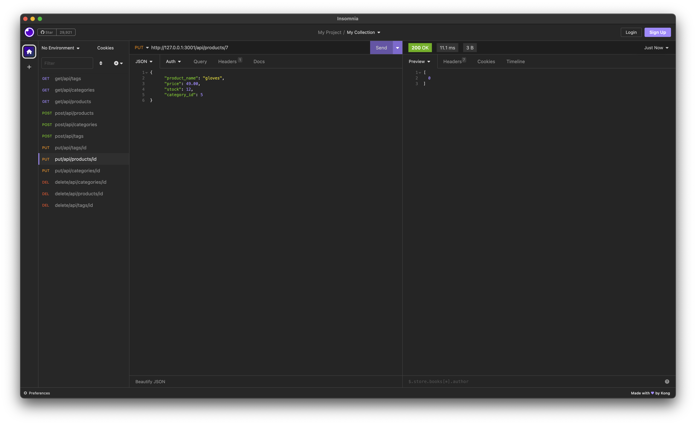
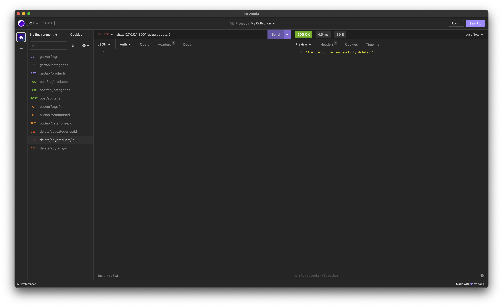

# E-Commerce
  

## Description
  This is a back-end application i'm building for an e-commerce website. The goal is to use a working Express.js API and configure it to use Sequelize to interact with a MySQL database. I'll use Insomnia to test my back end and make sure everything works as expected.

  Tech used:

  * Express.js
  * MySQL2
  * Sequelize
  * .env

## Table of contents
  * [Installation](#installation)
  * [Usage](#usage)
  * [Display](#display)
  * [License](#license)
  * [Contributors](#contributors)
  * [Test](#test)
  * [Questions](#questions)

## Installation
  Use the command "npm i" to install neccessary packages to run this application.

## Usage
  https://drive.google.com/file/d/193klQrJsytgMELcxM_Ljbg2Qr44AHli6/view

## Display
  
  
  
  

## License
  https://mit-license.org/

## Contributors
  Travis Rivera

## Test
  To test this application I used Insomnia but you can use other API tools such as Postman.

## Questions
  Travis3214@yahoo.com

  https://github.com/Travis3214
  